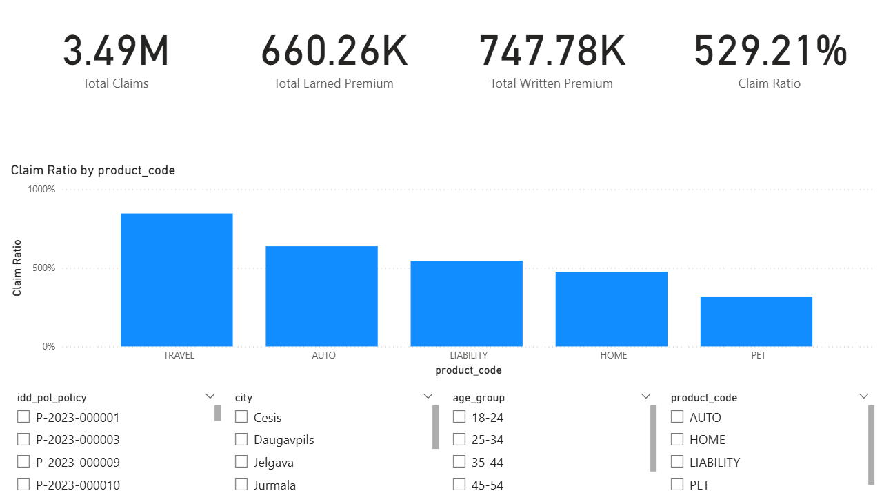
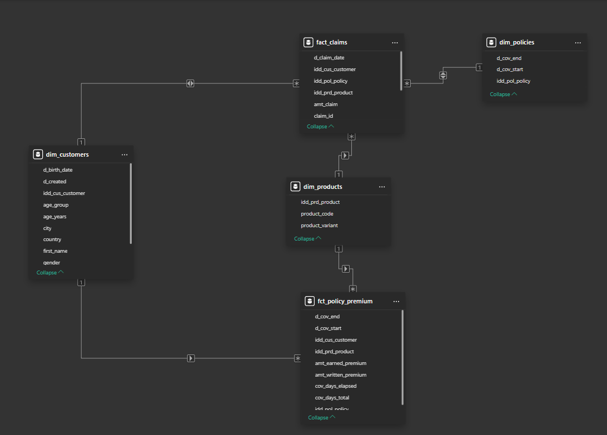

# Answers

This README mirrors the structure of the assignment tasks in order.

---

## Repository

**1.** Create a Git repo (Bitbucket/GitHub/other).  
✅ Done. The project lives in a GitHub repo with a clean commit history. The local working folder is:  
`C:\Users\kzaum\Documents\Career\Homework\balta_data_architect_task`

**2.** Organize code by folders (`dbt`, `pipelines`, `docs`).  
✅ Done. Final structure:
- `dbt/` – dbt project (models, seeds, profiles, warehouse)  
- `pipelines/` – Python scripts (`validate_data.py`, `offers_uniqueness.py`, `export_for_pbi.py`)  
- `docs/` – documentation (this file, Full_Report.md, pipeline diagram), plus `docs/validation_report.md`  
- `exports/` – CSV exports for Power BI  

---

## GenAI

**1.** LLM usage must be documented.  
✅ Documenation:  
I used ChatGPT 5 (Thinking), Gemini 2.5 Pro, and Claude Opus 4.1 mainly as support tools to speed up my workflow. 
At the start, I asked them for rough process overviews to get inspiration on where to begin, 
then compared their answers and had them point out each other’s mistakes. Based on this, I created my own plan and repository layout.  

I also used them to:  
- Provide adittional clarity to a few confusing task descriptions.
- Help me setup my environment and local dbt, e.g., dependencies, yml files, debugging. 
- Clarify dbt SQL syntax and concepts of *silver* and *gold* layers.  
- Suggest improvements for Python scripts and help debug issues.  
- Give feedback on how to structure relationships in Power BI tables.
- Profread grammar and add better phrasing and formatting to this README.

All outputs from the models were treated as drafts or suggestions — I revised, corrected, and implemented the final solution myself, 
as LLMs are known to make mistakes and miss important details.

---

## Data extraction and transformation (ETL)

### 1. Medallion with dbt (locally)

**1.a** Build **fact_claims** (claims + policies join).  
✅ Implemented as `dbt/models/gold/fact_claims.sql`. level = **claim**.  

**1.b** Build **dim_customers**.  
✅ Implemented as `dbt/models/gold/dim_customers.sql`.

**1.c** What **new dimensions** can be derived from **customers**?  
✅ `age_group`, `age_years`.

**1.d** Build **dim_products** from **policies**.  
✅ Implemented as `dbt/models/gold/dim_products.sql`.  

**1.e** What **new dimensions** can be derived from **policies**?  
✅ `total_policy_term_days`, `days_till_policy_expiry`, `elapsed_policy_days`.

---

### 2. Business logic

**2.a** Compute **earned_premium** for each policy.  
✅ Implemented in `dbt/models/gold/fct_policy_premium.sql`:  
`earned_premium = written_premium * elapsed_days / total_days` 

**2.b** Compute **Claim Ratio** = Σ(claim_amount) / Σ(earned_premium).  
✅ Implemented as `dbt/models/gold/mart_claim_ratio_by_product.sql` and DAX measure in Power BI.  

**2.c Optimized SQL for average premium and average claim by customer age groups**  
✅ Implemented as `dbt/models/gold/mart_avg_by_age_group.sql`.
Age groups taken from `dbt/models/gold/dim_customers.sql`.


**2.d** Counting strategy when logic differs by product.  
✅ Different products use different counting rules, for example, AUTO counts vehicles, HOME counts risk objects, 
TRAVEL counts policies. Adding them together directly makes no sense. The best solution is to keep the fact table consistent 
(for example, one row per policy) and use a small mapping that tells the system which counting rule applies for each product. 
This way reports show the right counts for every product type.

Example:
| policy_id | product | vehicles | risks | amt_written_premium |
|-----------|---------|----------|-------|---------------------|
| P1        | AUTO    | 2        | NULL  | 100                 |
| P2        | HOME    | NULL     | 3     | 200                 |
| P3        | TRAVEL  | NULL     | NULL  | 50                  |

Answer: total of 6 (2 + 3 + 1) instead of just 3 policies.

---

## 3. Python integration

**3.a** Script for **data validation**.  
✅ `pipelines/validate_data.py` → `docs/validation_report.md`. 
Checks:
- Duplicate policies  
- End < Start dates  
- Claims without a matching policy from policy table
- Missing/implausible birth dates  
- Claims outside coverage window

**3.b** Script for **uniqueness in offers**.  
✅ `pipelines/offers_uniqueness.py` → flags `is_unique_day/week/month`. Output: `exports/offers_with_uniqueness.csv`.
➡️ Compares each offer to the next one in time, flagging it as unique if no later offer exists in the same window. 
This prevents double-counting and gives accurate daily, weekly, and monthly unique offer counts.

**3.c** Is Python the most efficient way? Alternatives?  
✅ Python is fine for moderate data. For scale, use SQL window functions (`LEAD()`, date diffs) inside dbt/warehouse.

---

## 4. Validate customers vs policies & claims

✅ dbt singular tests confirm:  
- Policies link to existing customers.  
- Customer dates plausible.  
Weaknesses observed:  
- Missing birth dates.  
- Implausible ages (guarded by test).  
- Free-text fields not standardized.  
- Claims inside coverage skipped (late-reported claims common, no `loss_date`).

---

## 5. CI/CD (Azure pipeline sketch)

✅ 
```mermaid
flowchart LR
  GIT[Azure Repos<br/>Stores dbt project, Python scripts, and Power BI model definitions] 
    --> CI[CI_Pipeline_Build<br/>Triggered on PR/commit → runs dbt seed/run/test in Dev]

  CI --> DEVDB[(Dev Database<br/>Temporary schema for staging + validating models)]
  CI --> QA[Test Results<br/>dbt tests + Python checks ensure data quality]

  GIT --> CD[CD_Pipeline_Release<br/>Triggered on merge to main → deploys to Prod]

  CD --> PRODDB[(Prod Database<br/>dbt models:<br/>• Silver = cleaned staging<br/>• Gold = conformed dims/facts<br/>• Aggregations = reporting summaries)]

  PRODDB --> PBI[Power BI Dataset<br/>Connected to Gold + Aggregations, refreshed via pipeline]
  PBI --> USERS[End Users / Dashboards<br/>Consume trusted production data]
  ```
This pipeline automates how data models move from development into production.
Everything lives in Azure Repos — the dbt project, Python checks, and Power BI definitions.

When I create a branch or pull request, the CI pipeline builds the models in a temporary dev schema and runs dbt tests plus Python data-quality checks. 
That ensures the code works and the data is clean before anyone merges it.

If the tests pass and we merge to main, the CD pipeline runs, deploying the models to the production database. 
There, we follow a layered approach: Silver tables are cleaned staging, 
Gold are conformed facts and dimensions, and Aggregations are pre-summed for reporting.

Finally, the pipeline triggers a Power BI dataset refresh so dashboards always show trusted production data.
End users only ever see the tested, validated version — which makes releases safe, repeatable, and automated.

---

## 6. Power BI Semantic Model

### 6.a.i Link claims with policy dimensions
✅ Implemented relationships in Power BI:
  - `fact_claims` → `dim_customers` (via `idd_cus_customer`)
  - `fact_claims` → `dim_products` (via `idd_prd_product`)
  - `fact_claims` → `dim_policies` (via `idd_pol_policy`)
  - `fct_policy_premium` → `dim_customers` and `dim_products`

This setup allows filtering by customer, product, and policy when analyzing claims or premiums.  
Example: Selecting a product in a slicer automatically narrows down related policies and claims.

---

### 6.a.ii Create fact measures
✅ Measures were created in Power BI:

```DAX
Total Premiums (Written) = SUM ( fct_policy_premium[amt_written_premium] )
Total Earned Premium    = SUM ( fct_policy_premium[amt_earned_premium] )
Total Claims            = SUM ( fact_claims[amt_claim] )
Claim Ratio (%)         = DIVIDE ( [Total Claims], [Total Earned Premium] )
```

### 6.b Demonstrate the model with a mock-up in Power BI
✅ Mock-up dashboard was built in Power BI to demonstrate the semantic model:

- **4 KPI cards**:
  - *Total Claims*
  - *Total Written Premium*
  - *Total Earned Premium*
  - *Claim Ratio (%)*
- **Bar chart**: Claim Ratio by `product_code`
- **Slicers**: 
  - `idd_pol_policy`
  - `city`
  - `age_group`
  - `product_code`

This setup shows how the semantic model supports interactive analysis:  
For example, selecting *HOME* in `product_code` and *Jelgava* in `city` will narrow down the policies and claims shown across the visuals.





